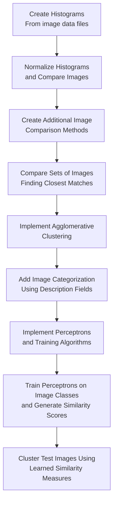

# Perceptron-Image-Analysis

Design and implementation of a machine learning pipeline that combines perceptrons and agglomerative clustering to analyze and group depth images.

# Motivation

- To combine supervised learning (perceptrons) with unsupervised learning (agglomerative clustering).
- This program trains perceptrons based on a labeled training set of depth images, and then uses those trained perceptrons to define a similarity measure between images.
- That similarity measure is then used to cluster a test set of depth images into groups of similar images.
- Familiarize myself with another style of documentation through JavaDocs.
- Make use of Gradle as a build tool.
- Utilize JUnit testing and evaluate code coverage using JaCoCo.

# Definition: Perceptron

- A perceptron is one of the simplest forms of an artificial neural network. It acts as a binary classifier by mapping multiple inputs into a single output value.
- A perceptron accepts `n` inputs:

$$
x_1, x_2, ..., x_n
$$

- Each input is assigned a corresponding weight:

$$
w_1, w_2, ..., w_n
$$

- The perceptron also includes a bias value, allowing the classifier to shift its decision boundary.
- The perceptron calculates the weighted sum of inputs plus the bias:

$$
output = \sum_{i=1}^{n} w_i x_i + b
$$

- In this project, each perceptron represents one image class. Instead of directly comparing image data, the trained perceptrons provide a learned representation that can be used to compare images.

# Task

This program expects three inputs:

1. A training set, expressed as a file containing depth image filenames.
2. A test set, expressed as a file containing depth image filenames.
3. `K`, the number of clusters the program should create.

`K` must be an integer greater than zero.

The program performs two major tasks:

1. Train a perceptron for every class represented in the training dataset.
2. Use the trained perceptrons to cluster the test images into `K` groups using a similarity metric.

It is required that the training dataset contain at least two classes. Each perceptron is trained for 100 epochs.

# Methodology

## Training Phase

- First, the training images are loaded from the provided training set.
- Each unique class label in the training data receives its own perceptron.
- The program trains each perceptron for 100 epochs using the labeled training images.
- After training, each perceptron can produce a score representing how strongly an image matches that class.

## Similarity Calculation

- Once the perceptrons have been trained, each test image is evaluated by every perceptron.
- Assume the training data contains `N` classes and therefore `N` trained perceptrons.
- Let `y_(n,i)` represent the score returned by perceptron `n` when evaluating test image `i`.

The similarity between two test images `i` and `j` is calculated as:

$$
sim(i,j)=\sum_{n=1}^{N}\frac{1}{(y_{n,i}-y_{n,j})^2}
$$

- This similarity measure compares images based on how similarly they are classified by the trained perceptrons.
- Images that produce similar perceptron outputs will have a higher similarity score.

## Clustering Phase

- Using the similarity metric above, the program performs agglomerative clustering.
- Initially, each image exists as its own cluster.
- The algorithm repeatedly merges the most similar clusters until only `K` clusters remain.
- The final clusters represent groups of images that have similar learned representations.

# Implementation Details

- The project is written in Java.
- Gradle is used for dependency management and building.
- JavaDocs are used to document classes and methods.
- JUnit is used for automated testing.
- JaCoCo is used to measure test coverage.

The final implementation is separated into several logical components:

- Image parsing and loading.
- Feature extraction and histogram generation.
- Perceptron training and evaluation.
- Similarity calculation.
- Agglomerative clustering.
- Output generation.

# Development Approach

I developed this incrementally, beginning with basic image comparison methods and building upon them with each iteration.

The development pipeline was:

Each stage was developed and tested independently before being combined into the final pipeline.

# Results

The final implementation achieved:

- 95% testing coverage (line, branch, and path).
- Full JavaDoc documentation.
- A working perceptron implementation with training capabilities.
- A learned similarity metric based on perceptron outputs.
- Agglomerative clustering using the learned image representations, with four different comparison methods.

The final program successfully combines supervised learning and clustering by using perceptrons as a feature extraction mechanism rather than relying only on direct image comparison.

# Future Improvements

Potential future improvements include:

- Extending support beyond depth images to RGB or larger image datasets.
- Training perceptrons using larger external image databases.
- Integrating with image search APIs to find visually similar images.
- Creating recommendation or organization tools, such as automatically grouping desktop images or creating custom image collections.

The concepts developed in this project could be extended into a larger image-search or recommendation system by replacing the small training dataset with a larger real-world dataset.
